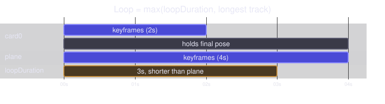

# Animation files

An animation file is a JSON array of animation objects, one per animated view. The editor
writes it; the runtime reads it out of your app bundle.

```json title="animation.json"
[
  {
    "id": "card0",
    "invokeType": "trigger",
    "initialValues": {
      "scale": 1,
      "translate": [0, 0],
      "rotate": 0,
      "rotateCenter": 0,
      "opacity": 1
    },
    "keyframes": [
      {
        "id": "1A9DA10A-9E90-49B6-943B-D10756FA3C2C",
        "duration": 0,
        "values": {
          "scale": 1,
          "translate": [-0.648, -0.003],
          "rotate": 0,
          "rotateCenter": 0,
          "opacity": 1
        }
      },
      {
        "id": "F5F9E292-E987-442C-89CC-C2CB09B56971",
        "duration": 3,
        "values": {
          "scale": 1,
          "translate": [0.008, -0.012],
          "rotate": 0,
          "rotateCenter": 0,
          "opacity": 1
        }
      }
    ]
  }
]
```

## Animation object

| Field | Type | Meaning |
| --- | --- | --- |
| `id` | string | Matches the id passed to `.inertia(_:)` on the view this animates. |
| `initialValues` | object | The pose the view sits at before the animation runs. |
| `invokeType` | `"auto"` \| `"trigger"` | Whether it plays on appear or waits to be triggered. |
| `keyframes` | array | The poses to animate through, in order. |

## Keyframe object

| Field | Type | Meaning |
| --- | --- | --- |
| `id` | string | Unique within the track. The editor writes UUIDs. |
| `duration` | number | Seconds to reach *this* keyframe from the previous one. |
| `values` | object | The pose at this keyframe. |

### `duration` is relative

This is the part of the format that surprises people. `duration` is not a timestamp and
not the length of the whole animation — it is the time taken to travel from the preceding
keyframe to this one.

So a track with durations `0, 1, 2` has keyframes at absolute times 0s, 1s, and 3s.

{ .diagram }

A leading keyframe with `duration: 0` is therefore a starting pose that takes no time to
reach, not a keyframe that waits.

!!! note "Non-positive durations are repaired, not honoured"

    Interpolation divides by the keyframe's duration, so the runtime rewrites any
    duration that is zero, negative or non-finite to 1ms before playing the track. That
    keeps a hand-edited file from producing `NaN` and a view that vanishes, but the
    keyframe reads as an instant jump, and every keyframe after it lands 1ms later than
    the file implies. The editor keeps its own durations above the same minimum.

    A leading keyframe at `duration: 0` is the normal case and behaves as intended: the
    view is at its starting pose 1ms in, which is not something you can see.

### `values`

Every keyframe carries all five values — there is no notion of animating only one
property and leaving the others alone. See [Animatable values](../reference/values.md).

## Loop length

The file does not record how long the loop is. At runtime the loop is

```
max(loopDuration, longest track in the file)
```

where `loopDuration` starts at the runtime default of 3 seconds and changes only when
your app sets `inertia.loopDuration` or the editor sends a new timeline length. A track
shorter than the loop holds its final pose until the loop comes around; a track longer
than `loopDuration` stretches the loop for every track, so they all still restart
together.

{ .diagram }

So an animation authored on a 5-second timeline plays from the bundle over a 5-second
loop only if one of its tracks actually runs the full 5 seconds. If the longest ends at
4 seconds the bundled loop is 4 seconds; if it ends at 2 seconds the loop falls back to
the 3-second default. Either keep the editor's loop duration at 3 seconds, or set
`inertia.loopDuration` in your app to the length you authored against.

## Naming and lookup

The container's `id` is the resource name: `InertiaContainer(id: "animation", …)` loads
`animation.json` from the bundle. One file holds every animation for that container.

Outside editor mode the file must exist and must decode — the container reads it during
initialization and traps if it cannot. An empty array is a valid file.
