# Animation IDs

An id is the only link between a view in your code and a track in an animation file. This
page covers how they behave, including the part that catches people out: what happens when
the same tagged view appears more than once.

Everything here applies to all three runtimes: the id model is one of the pieces they
implement identically.

## The id you write

=== "SwiftUI"

    ```swift
    Image(systemName: "airplane").inertia("plane")
    ```

=== "Compose"

    ```kotlin
    Inertia(id = "plane") {
        Text("✈")
    }
    ```

=== "React"

    ```tsx
    <Inertia id="plane">
      <span>✈</span>
    </Inertia>
    ```

`"plane"` is an **id shared by every instance**. It is what you look up in the animation
file, what you pass to `trigger`, and what appears as an animation's `id` in
`animation.msgpack`. All three runtimes call this parameter `id` for exactly that reason —
one id, one animation, however many views wear it.

## The id in the hierarchy

Internally each *instance* of a tagged view gets a distinct hierarchy id, formed by
appending an index to the prefix:

```
plane--0
plane--1
plane--2
```

Indices are handed out in the order the instances first appear. This is what lets the
editor's hierarchy panel distinguish three copies of the same view, and what lets you
select one of them in the simulator.

## Instances share an animation

Animations are stored per prefix. When the runtime looks up which track a view should
play, an unmapped instance falls back to the prefix — so all instances of `plane` play the
same animation.

=== "SwiftUI"

    ```swift
    ForEach(0..<3) { _ in
        Image(systemName: "airplane").inertia("plane")   // one animation, three views
    }
    ```

=== "Compose"

    ```kotlin
    repeat(3) {
        Inertia(id = "plane") { Text("✈") }   // one animation, three views
    }
    ```

=== "React"

    ```tsx
    {[0, 1, 2].map(i => (
      <Inertia key={i} id="plane">   {/* one animation, three views */}
        <span>✈</span>
      </Inertia>
    ))}
    ```

{ .diagram }

If you want the three planes moving differently, give them different ids — `planeTop`,
`planeMiddle`, `planeBottom`.

Triggering works on the prefix too: `inertia.trigger("plane")` starts all three. Playback
is keyed by prefix on every runtime, which is what makes that true.

## Choosing ids

Ids are strings, and nothing validates them against your code. A typo is a view that
silently never animates, so it is worth keeping the two ends together:

=== "SwiftUI"

    ```swift
    enum AnimationID: String, CaseIterable {
        case card0, card1, planeTop, planeBottom

        var id: String { rawValue }
    }

    RoundedRectangle(cornerRadius: 12)
        .inertia(AnimationID.card0.id)

    // ...

    inertia.trigger(AnimationID.card0.id)
    ```

=== "Compose"

    ```kotlin
    enum class AnimationID(val id: String) {
        CARD0("card0"), CARD1("card1"), PLANE_TOP("planeTop"), PLANE_BOTTOM("planeBottom")
    }

    Inertia(id = AnimationID.CARD0.id) { /* … */ }

    // ...

    inertia.trigger(AnimationID.CARD0.id)
    ```

=== "React"

    ```ts
    export const AnimationID = {
      card0: "card0",
      card1: "card1",
      planeTop: "planeTop",
      planeBottom: "planeBottom",
    } as const;
    ```

    ```tsx
    <Inertia id={AnimationID.card0}>{/* … */}</Inertia>

    // ...

    inertia.trigger(AnimationID.card0);
    ```

The enumeration also gives you a list to check an animation file against in a test, if you
want a build to fail rather than a view to sit still.

## Index stability

Instance indices depend on appearance order, not on anything in your source. A view that
appears conditionally can take a different index between runs, and the editor's hierarchy
will differ accordingly.

In practice this matters for two things:

- **Recording.** Record against the instance you actually want; if the hierarchy shifts,
  check which node is selected before you record.
- **Reopening a project.** Tracks are keyed by prefix, so reopening a project and running
  the app again finds the animations regardless of how indices came out.

## The container's ids

=== "SwiftUI"

    `InertiaContainer` takes two:

    | Parameter | Purpose |
    | --- | --- |
    | `id` | The animation file's resource name. `id: "animation"` loads `animation.msgpack`. |
    | `hierarchyId` | The root node's id in the tree the editor draws. |

    They can be the same string — the example app uses `"animation"` for both — but they
    mean different things. Change `id` and you change which file loads; change
    `hierarchyId` and you rename the root of the hierarchy.

=== "Compose"

    `InertiaContainer` takes one: `id`. It is both the container id the editor addresses,
    and the id of the root node in the tree the editor draws.

=== "React"

    `InertiaContainer` takes one: `id`. It is the container id the editor addresses, the id
    of the root node in the tree the editor draws, and the basename of the file fetched
    from `baseURL` outside editor mode.

On every runtime, `id` is the container id the editor addresses its schemas to, and the
editor always sends `"animation"`. A container with a different `id` connects and reports
its hierarchy but receives nothing — so keep `id` as `"animation"` for anything you author
in the editor.
