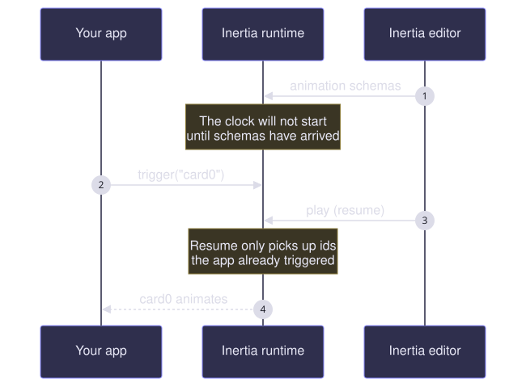

# Triggering animations

An Inertia animation does not start on its own. The runtime plays a view's track once two
things are true: the container's clock is running, and that view's id has been triggered.
Both come from one call.

{ .diagram }

## Triggering from your app

Reach the container's playback handle and call `trigger` with the same id you tagged the
view with:

=== "SwiftUI"

    ```swift
    struct ContentView: View {
        @Environment(\.inertiaDataModel) private var inertia: InertiaDataModel!

        var body: some View {
            VStack(spacing: 24) {
                RoundedRectangle(cornerRadius: 12)
                    .fill(.blue)
                    .frame(width: 200, height: 120)
                    .inertia("card0")

                Button("Animate") {
                    inertia.trigger("card0")
                }
            }
        }
    }
    ```

    The environment value is only populated inside an `InertiaContainer` — it is `nil`
    anywhere else, which is why the force-unwrapped type above is safe in practice and
    crashes loudly if you put the view outside a container.

=== "Compose"

    ```kotlin
    @Composable
    fun ContentView() {
        val inertia = LocalInertia.current

        Column(verticalArrangement = Arrangement.spacedBy(24.dp)) {
            Inertia(id = "card0") {
                Box(Modifier.size(200.dp, 120.dp).background(Color.Blue))
            }

            Button(onClick = { inertia.trigger("card0") }) {
                Text("Animate")
            }
        }
    }
    ```

    `LocalInertia` has no default — reading it outside an `InertiaContainer` throws with
    *"LocalInertia was read outside of an InertiaContainer."*

=== "React"

    ```tsx
    function ContentView() {
      const inertia = useInertia();

      return (
        <div>
          <Inertia id="card0">
            <div style={{ width: 200, height: 120, background: "blue" }} />
          </Inertia>

          <button onClick={() => inertia.trigger("card0")}>Animate</button>
        </div>
      );
    }
    ```

    `useInertia` throws *"useInertia must be used within an InertiaContainer"* if there is
    no container above it.

## Playing on appear

=== "SwiftUI"

    There is no declarative "play on appear". Trigger it yourself:

    ```swift
    RoundedRectangle(cornerRadius: 12)
        .inertia("card0")
        .onAppear { inertia.trigger("card0") }
    ```

    !!! note "`invokeType` in the file"

        Animation files carry an `invokeType` of `"auto"` or `"trigger"`. The SwiftUI
        runtime stores it but does not act on it: a track with `"auto"` still waits for
        `trigger(_:)`. Treat the field as metadata the editor round-trips, and drive
        playback from your own code.

=== "Compose"

    An animation whose `invokeType` is `"auto"` starts as soon as the runtime holds its
    schema — you do not have to trigger it.

    For a `"trigger"` animation, do it yourself:

    ```kotlin
    LaunchedEffect(Unit) {
        inertia.trigger("card0")
    }
    ```

=== "React"

    An animation whose `invokeType` is `"auto"` starts as soon as the runtime holds its
    schema — you do not have to trigger it.

    For a `"trigger"` animation, do it yourself:

    ```tsx
    React.useEffect(() => {
      inertia.trigger("card0");
    }, [inertia]);
    ```

!!! warning "`invokeType: auto` is not honoured everywhere"

    Compose and React start `auto` animations for you. **SwiftUI does not** — it stores
    the field and ignores it. An animation authored as `auto` and shipped on iOS still
    needs a `trigger(_:)` call.

## Triggering several views together

Each id is triggered separately, but they share one clock, so triggering them in the same
turn starts them together:

=== "SwiftUI"

    ```swift
    Button("Animate all") {
        inertia.trigger("card0")
        inertia.trigger("card1")
        inertia.trigger("plane")
    }
    ```

=== "Compose"

    ```kotlin
    Button(onClick = {
        inertia.trigger("card0")
        inertia.trigger("card1")
        inertia.trigger("plane")
    }) { Text("Animate all") }
    ```

=== "React"

    ```tsx
    <button onClick={() => {
      inertia.trigger("card0");
      inertia.trigger("card1");
      inertia.trigger("plane");
    }}>Animate all</button>
    ```

While repeating, every track is padded to the loop length, so tracks of different lengths
still restart in step with each other.

## Stopping and restarting

`trigger` does not reset a track that is already playing — a trigger arriving mid-run
joins the run in progress.

=== "SwiftUI"

    ```swift
    inertia.cancel("card0")   // back to initialValues, and stays there
    inertia.restart("card0")  // clears the cancel and plays from the top
    inertia.isCancelled("card0")
    ```

    `restart` rewinds the shared clock, so it starts *every* animation in the container
    over, not just this one. That is the same shared clock that makes a mid-run trigger
    join the run in progress.

    `pause`, `seek` and `resume` also exist, but only the editor can reach them.

=== "Compose"

    ```kotlin
    inertia.cancel("card0")   // back to initialValues, and stays there
    inertia.restart("card0")  // clears the cancel and plays from the top
    inertia.isCancelled("card0")
    ```

    `restart` rewinds the shared clock, so it starts *every* animation in the container
    over, not just this one. That is the same shared clock that makes a mid-run trigger
    join the run in progress.

=== "React"

    ```tsx
    inertia.cancel("card0");   // back to initialValues, and stays there
    inertia.restart("card0");  // clears the cancel and plays from the top
    inertia.isCancelled("card0");
    ```

    `restart` rewinds the shared clock, so it starts *every* animation in the container
    over, not just this one. That is the same shared clock that makes a mid-run trigger
    join the run in progress.

## Repeating

Animations repeat by default. Turn it off:

=== "SwiftUI"

    ```swift
    inertia.isRepeating = false
    inertia.trigger("card0")
    ```

=== "Compose"

    ```kotlin
    LaunchedEffect(inertia) {
        inertia.isRepeating = false
    }
    ```

=== "React"

    ```tsx
    React.useEffect(() => {
      inertia.isRepeating = false;
    }, [inertia]);
    ```

With repeating off, each track plays its own keyframes once and stops on its final pose.
With it on, tracks are held out to the full loop duration and start over together.

## Loop duration

=== "SwiftUI"

    ```swift
    inertia.loopDuration = 1.5   // seconds
    ```

    Assigning to `loopDuration` does **not** clamp — the property takes whatever you give
    it, including a value outside the usable range. Only the editor's timeline messages
    are clamped on the way in. Run your own values through the same helper if they come
    from somewhere you do not control:

    ```swift
    inertia.loopDuration = InertiaPlayback.clampLoopDuration(userValue)
    ```

    `InertiaPlayback` exposes the same constants the editor uses:

    ```swift
    InertiaPlayback.defaultLoopDuration   // 3.0
    InertiaPlayback.loopDurationRange     // 0.1...60.0
    InertiaPlayback.clampLoopDuration(_:) // brings a value into range, non-finite included
    ```

=== "Compose"

    ```kotlin
    inertia.loopDuration = 1.5f   // seconds
    ```

    Assigning does not clamp, the same as on SwiftUI. Run untrusted values through the
    helper yourself:

    ```kotlin
    inertia.loopDuration = InertiaPlayback.clampLoopDuration(userValue)
    ```

    ```kotlin
    InertiaPlayback.defaultLoopDuration   // 3.0f
    InertiaPlayback.loopDurationRange     // 0.1f..60.0f
    InertiaPlayback.clampLoopDuration(seconds)
    ```

=== "React"

    ```tsx
    inertia.loopDuration = 1.5;   // seconds
    ```

    Assigning does not clamp, the same as on SwiftUI. The constants live on
    `InertiaPlayback` in `inertia-base`:

    ```ts
    import { InertiaPlayback } from "inertia-base";

    InertiaPlayback.defaultLoopDuration;   // 3.0
    InertiaPlayback.loopDurationRange;     // { lowerBound: 0.1, upperBound: 60 }
    InertiaPlayback.clampLoopDuration(seconds);
    ```

Whichever runtime you are on, the editor overwrites `loopDuration` whenever its timeline is
resized — so a value you set before attaching the editor will be replaced by the one the
timeline shows.

The loop the runtime actually plays is `max(loopDuration, longest track)` on every
runtime, so a track longer than the loop stretches it rather than being cut off.

## Triggering in editor mode

This is one of the sharper differences between the runtimes.

=== "SwiftUI"

    The editor's transport does not trigger anything. Its play button pushes the current
    schemas and sends a *resume*, and resume deliberately only picks up actionables your
    app has already triggered — starting one is the app's call, not the editor's.

    So a view that is never triggered stays still in the editor too, however many times
    you press play. Give the app a way to trigger while you are authoring — a button, or
    an `.onAppear` — or you will be recording against a view that never moves.

    For the same reason, `trigger(_:)` in editor mode does nothing until the editor has
    sent its schemas: the clock will not start while the container has no animations
    loaded, which in editor mode it does not until an editor attaches.

    { .diagram }

=== "Compose"

    The editor's play button starts **every** registered animation, whatever its
    `invokeType`. Authoring a `trigger` animation is exactly the moment nothing is going
    to call `trigger` for it, so the editor stands in for the app.

    You therefore do not need a trigger button in the app just to author against it —
    though one is still useful for checking how the animation reads on a real interaction.

    Signals only ever come from the editor, so the same animation running with no editor
    attached still waits for its trigger.

=== "React"

    The editor's play button starts **every** animation whose schema the runtime holds,
    whatever its `invokeType`. Authoring a `trigger` animation is exactly the moment
    nothing is going to call `trigger` for it, so the editor stands in for the app.

    You therefore do not need a trigger button in the app just to author against it —
    though one is still useful for checking how the animation reads on a real interaction.

    Signals only ever come from the editor, so the same animation running with no editor
    attached still waits for its trigger.

## What triggering does not do

`trigger` sets a view's track running, clears any frame the editor has the playhead parked
on, and starts the container's clock. It does not reset a track that is already playing —
on Compose and React that is what `restart` is for, and on SwiftUI there is no equivalent.
