# Inertia

Inertia is a keyframe animation editor for animating the UI you already built. You wrap
the views you want to move, run your app inside the editor, drag those views around on a
timeline, and Inertia writes the result to a MessagePack file your app loads.

There is no separate rendering surface and no exported video. The thing you animate in
the editor is the real view in your real app.

Three runtimes read the animations the editor writes:

| Runtime | Package | Editor target |
| --- | --- | --- |
| **SwiftUI** | `Inertia` (Swift package) | **iOS** — a live iOS Simulator |
| **Jetpack Compose** | `com.github.hpennington:inertia-compose` | **Android** — a running emulator |
| **React** | `inertia-react` + `inertia-base` | **Web** — your dev server in a web view |

They implement the same model against the same file format. [Choosing a
runtime](getting-started/runtimes.md) is the page to read if you want to know where they
still differ — and they do, in ways worth knowing before you start.

- :material-download: **[Install a runtime](getting-started/installation.md)**

    Add the package to your app and wrap your root view.

- :material-rocket-launch: **[Quickstart](getting-started/quickstart.md)**

    Get a view moving in about ten minutes.

- :material-timeline-clock: **[Use the editor](editor/overview.md)**

    Record keyframes against a live app.

- :material-code-json: **[Animation file format](guides/animation-file.md)**

    What the editor writes, and what the runtimes read.

## How it fits together

{ .diagram }

In **editor mode** the editor hosts a local WebSocket server and your app connects to it.
The app reports its Inertia-tagged view hierarchy, and the editor pushes animation schemas
back as you edit, so what you see running is the animation as it currently stands.

In **release mode** none of that is running. The container loads `animation.inertia` for
itself — out of the app bundle in SwiftUI, over HTTP in React — and plays it on its own
clock. In SwiftUI the WebSocket client is gated on the same `dev` flag, so a shipped build
never dials out. (The Compose runtime does not yet have a release path; see
[Choosing a runtime](getting-started/runtimes.md).)

## What you can animate

Each tagged view gets a track of keyframes over five values:

| Value | Meaning |
| --- | --- |
| `translate` | `[x, y]` offset, as a fraction of the container's size |
| `scale` | Uniform scale factor (`1.0` is unchanged) |
| `rotate` | Rotation in degrees, anchored top-left |
| `rotateCenter` | Rotation in degrees, anchored at the view's center |
| `opacity` | `0.0` transparent through `1.0` opaque |

See [Animatable values](reference/values.md) for the details, including why `translate`
is normalized rather than in points.

## Platform support

The editor is a macOS app. What it drives depends on the target you pick in its framework
picker:

| Target | Runtime requirement | How the editor reaches it |
| --- | --- | --- |
| iOS | iOS 17+ / Swift 5.9+ | An iOS Simulator, driven through `simctl` |
| Android | `minSdk` 26, Compose | A running emulator, streamed over `adb` |
| Web | React 18.3 | Your dev server, loaded in a `WKWebView` |

The iOS 17 floor is not arbitrary: the SwiftUI runtime plays tracks through
`KeyframeAnimator`, an iOS 17 API. The Compose and React runtimes sample their tracks
themselves and have no equivalent floor.

## Where to go next

Start with [Choosing a runtime](getting-started/runtimes.md) to see what each one can do
today, then [Installation](getting-started/installation.md). If you would rather read
about the workflow before touching your project, the [editor tour](editor/overview.md) is
the shortest route to understanding what Inertia actually does.
